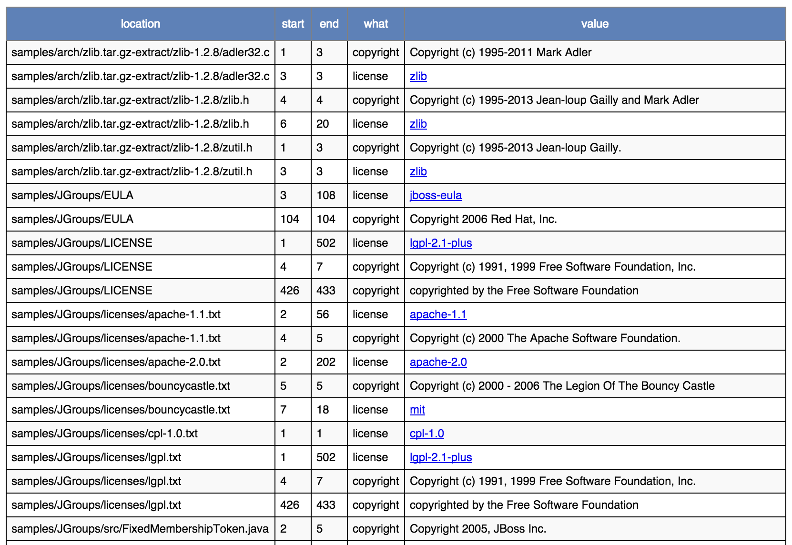
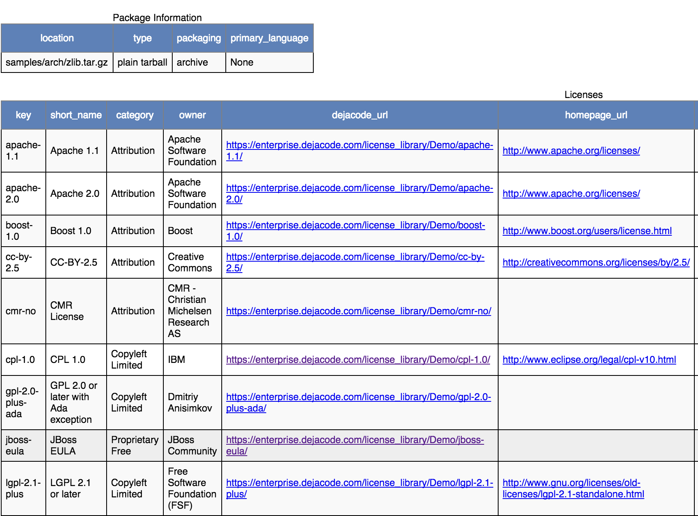

.. _cli_synopsis:

Synopsis
========

ScanCode detects licenses, copyrights, package manifests and direct dependencies and more, both
in source code and binary files, by scanning the files. This page introduces you to the ScanCode
Toolkit Command Line Interface in the following sections:

- Installation
- Quickstart
- Type of Options
- Output Formats
- Other Important Documentation

.. _syn_install:

Installation
------------

Scancode-Toolkit installation can be done by downloading ScanCode as an application, which
is recommended generally. For users who wish to use ScanCode as a library, it can be
installed via ``pip``, the default Python Package Manager. Refer the following sections for
detailed Instructions on the each of the Installation Methods.

- :ref:`app_install`
- :ref:`pip_install`
- :ref:`source_code_install`

.. _synopsis_quickstart:

Quickstart
----------

The basic command to perform a scan, in case of a download and configure installation
(on Linux/MacOS) is::

    path/to/scancode [OPTIONS] <OUTPUT FORMAT OPTION(s)> <SCAN INPUT>

The basic usage, if Scancode is installed from ``pip``, or in Windows::

    scancode [OPTIONS] <OUTPUT FORMAT OPTION(s)> <SCAN INPUT>

Here Scancode scans the <SCAN INPUT> file or directory for license, origin and packages and saves
results to FILE(s) using one or more output format option. Error and progress are printed to
stdout.

To scan the ``samples`` directory distributed with ScanCode-Toolkit, the command will be::

   scancode -clpieu --json-pp path/to/output.json path/to/samples

.. include::  /rst_snippets/note_snippets/synopsis_output_format.rst

Alternatively, in case of download and configure installations, where ``path/to/scancode`` is used
(the path from root of file system) we can go into the scancode directory
(like ``scancode-toolkit-3.1.1``) and then use ``./scancode``. The same applies for input and
output options. To scan a folder ``samples`` inside ScanCode directory, and output to a file
``output.json`` in the same directory, the command will be::

    ./scancode -clpieu --json-pp output.json samples

While a scan using absolute paths from the file system root will look like::

    home/ayansm/software/scancode-toolkit-3.1.1/scancode -clpieu --json-pp home/ayansm/scan_scan_results/output.json home/ayansm/codebases/samples/

Commands similar to ``scancode -clpi --json-pp output.json samples`` will be used as examples
throughout the documentation.

- Here we are inside the ``virtualenv`` where Scancode-Toolkit is configured.

- And the default ``samples`` folder is being scanned, which is distributed by default with
  Scancode-Toolkit.

.. _scancode_cli_options:

Type of Options
---------------

ScanCode Toolkit Command Line options can be divided into these major sections:

- :ref:`cli_basic`
- :ref:`Extractcode Options <cli_extract>`
- :ref:`cli_core`
- :ref:`cli_output_control_filters`
- :ref:`cli_pre_scan`
- :ref:`cli_post_scan`

Refer the individual pages which are linked to above, for detailed discussions on the Command
Line Options listed under each section.

.. _synopsis_output:

Output Formats
--------------

The output file format is set by using the various output options. The recommended output format
is JSON. If ``--json`` is used, the entire file being in one line, without whitespace characters.

The following example scans will show you how to run a scan with each of the result formats. For
the scans, we will use the ``samples`` directory provided with the ScanCode Toolkit.

.. include::  /rst_snippets/tip_snippets/stdout.rst

JSON file output
^^^^^^^^^^^^^^^^

Scan the ``samples`` directory and save the scan to a JSON file (pretty-printed):::

    scancode -clpieu --json-pp output.json samples

A sample JSON output file structure will look like::

    {
      "headers": [
        {
          "tool_name": "scancode-toolkit",
          "tool_version": "3.1.1",
          "options": {
            "input": [
              "samples/"
            ],
            "--copyright": true,
            "--email": true,
            "--info": true,
            "--json-pp": "output.json",
            "--license": true,
            "--package": true,
            "--url": true
          },
          "notice": "Generated with ScanCode and provided on an \"AS IS\" BASIS, WITHOUT WARRANTIES\nOR CONDITIONS OF ANY KIND, either express or implied. No content created from\nScanCode should be considered or used as legal advice. Consult an Attorney\nfor any legal advice.\nScanCode is a free software code scanning tool from nexB Inc. and others.\nVisit https://github.com/nexB/scancode-toolkit/ for support and download.",
          "start_timestamp": "2019-10-19T191117.292858",
          "end_timestamp": "2019-10-19T191219.743133",
          "message": null,
          "errors": [],
          "extra_data": {
            "files_count": 36
          }
        }
      ],
      "files": [
        {
          "path": "samples",
          "type": "directory",
          ...
          ...
          ...
          "scan_errors": []
        },
        {
          "path": "samples/README",
          "type": "file",
          "name": "README",
          "base_name": "README",
          "extension": "",
          "size": 236,
          "date": "2019-02-12",
          "sha1": "2e07e32c52d607204fad196052d70e3d18fb8636",
          "md5": "effc6856ef85a9250fb1a470792b3f38",
          "mime_type": "text/plain",
          "file_type": "ASCII text",
          "programming_language": null,
          "is_binary": false,
          "is_text": true,
          "is_archive": false,
          "is_media": false,
          "is_source": false,
          "is_script": false,
          "licenses": [],
          "license_expressions": [],
          "copyrights": [],
          "holders": [],
          "authors": [],
          "packages": [],
          "emails": [],
          "urls": [],
          "files_count": 0,
          "dirs_count": 0,
          "size_count": 0,
          "scan_errors": []
        },
        ...
        ...
        ...
        {
          "path": "samples/zlib/iostream2/zstream_test.cpp",
          "type": "file",
          "name": "zstream_test.cpp",
          "base_name": "zstream_test",
          "extension": ".cpp",
          "size": 711,
          "date": "2019-02-12",
          ...
          ...
          ...
          "scan_errors": []
        }
      ]
    }

A sample JSON output for an individual file will look like::

    {
      "path": "samples/zlib/iostream2/zstream.h",
      "type": "file",
      "name": "zstream.h",
      "base_name": "zstream",
      "extension": ".h",
      "size": 9283,
      "date": "2019-02-12",
      "sha1": "fca4540d490fff36bb90fd801cf9cd8fc695bb17",
      "md5": "a980b61c1e8be68d5cdb1236ba6b43e7",
      "mime_type": "text/x-c++",
      "file_type": "C++ source, ASCII text",
      "programming_language": "C++",
      "is_binary": false,
      "is_text": true,
      "is_archive": false,
      "is_media": false,
      "is_source": true,
      "is_script": false,
      "licenses": [
        {
          "key": "mit-old-style",
          "score": 100.0,
          "name": "MIT Old Style",
          "short_name": "MIT Old Style",
          "category": "Permissive",
          "is_exception": false,
          "is_unknown": false,
          "owner": "MIT",
          "homepage_url": "http://fedoraproject.org/wiki/Licensing:MIT#Old_Style",
          "text_url": "http://fedoraproject.org/wiki/Licensing:MIT#Old_Style",
          "reference_url": "https://enterprise.dejacode.com/urn/urn:dje:license:mit-old-style",
          "spdx_license_key": null,
          "spdx_url": null,
          "start_line": 9,
          "end_line": 15,
          "matched_rule": {
            "identifier": "mit-old-style_cmr-no_1.RULE",
            "license_expression": "mit-old-style",
            "licenses": [
              "mit-old-style"
            ],
            "is_license_text": true,
            "is_license_notice": false,
            "is_license_reference": false,
            "is_license_tag": false,
            "matcher": "2-aho",
            "rule_length": 71,
            "matched_length": 71,
            "match_coverage": 100.0,
            "rule_relevance": 100
          }
        }
      ],
      "license_expressions": [
        "mit-old-style"
      ],
      "copyrights": [
        {
          "copyright": "Copyright (c) 1997 Christian Michelsen Research AS Advanced Computing",
          "start_line": 3,
          "end_line": 5
        }
      ],
      "holders": [
        {
          "holder": "Christian Michelsen Research AS Advanced Computing",
          "start_line": 3,
          "end_line": 5
        }
      ],
      "authors": [],
      "packages": [],
      "emails": [],
      "urls": [
        {
          "url": "http://www.cmr.no/",
          "start_line": 7,
          "end_line": 7
        }
      ],
      "files_count": 0,
      "dirs_count": 0,
      "size_count": 0,
      "scan_errors": []
    },

Static HTML output
^^^^^^^^^^^^^^^^^^

Scan the ``samples`` directory for licenses and copyrights and save the scan results to an HTML
file. When the scan is done, open ``samples.html`` in your web browser.

::

   scancode -clpieu --html output.html samples

.. include::  /rst_snippets/other_imp_doc.rst
